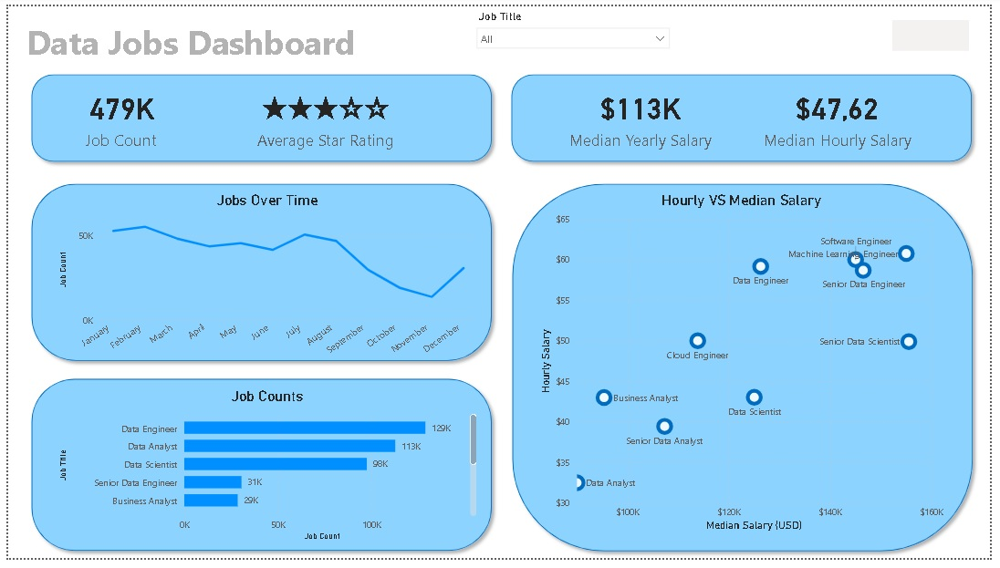
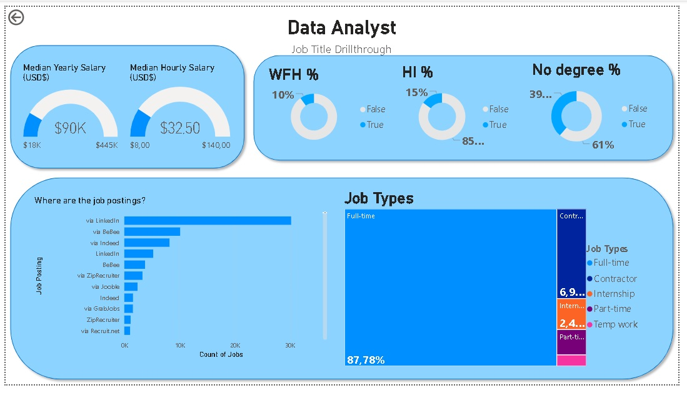

# Data Jobs Dashboard

*Project by [@lukebarousse]– Power BI Course Project*

## Introduction
The **Data Jobs Dashboard** was created for job seekers, career changers, and professionals exploring new opportunities in data-related roles. Often, information about the data job market is scattered across multiple sources, making it hard to get a clear picture. This dashboard consolidates real-world data from 2024 data science job postings—including job titles, salaries, and locations—into a single, user-friendly interface for exploring trends and compensation.

## What I Learned / Skills Highlighted
While building this project, several key Power BI skills were applied:

- **⚙️ Data Transformation (ETL) with Power Query:** Cleaned and shaped raw data by handling missing values, adjusting data types, and creating calculated columns.  
- **🧮 Implicit Measures & KPIs:** Created measures to track insights like Median Salary and Total Job Count.  
- **📊 Visualizations:** Used Column, Bar, Line, and Area charts to compare job counts and visualize trends.  
- **🔢 KPI Indicators & Tables:** Displayed critical metrics using Cards and detailed data with Tables.  
- **🎨 Dashboard Design:** Focused on creating a clean, intuitive layout that communicates insights effectively.  
- **🖱️ Interactive Features:**  
  - **Slicers:** Filter the report by job title dynamically.  
  - **Buttons & Bookmarks:** Navigate seamlessly across the dashboard.  
  - **Drill-Through:** Dive from high-level overviews into detailed analyses of specific job roles.

## Dashboard Structure

### Page 1: High-Level Market Summary
  
This page provides a snapshot of the data job market, featuring key metrics such as total job postings, median salaries, and the most common job titles. It’s designed to give a quick, at-a-glance understanding of the market.

### Page 2: Job-Specific Drill-Through
From the main page, users can drill through to analyze a specific job title in detail. This view includes salary ranges, remote work statistics, and the top platforms posting these roles.

## Conclusion
This project demonstrates how Power BI can turn raw job posting data into a comprehensive, interactive tool. Users can filter, slice, and drill through data to make well-informed decisions about career paths and market trends.
